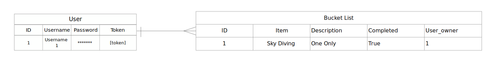

# Yolo Bucket
YOLO Bucket is the place to keep track of all the number of experiences or achievements you have or accomplish during your lifetime. You only live once after all!

Once you've signed up and signed in, you can create a Yolo Bucket list item. If you've always wanted to go skydiving you can create this adventure, give a description and submit! Once you've completed this you can mark it complete!

- [Yolo Bucket Deployed Website](https://nancyho629.github.io/yolo-client/)
- [Yolo Bucket Client Repo](https://github.com/nancyho629/yolo-client)
- [Yolo Bucket API Repo](https://github.com/nancyho629/yolo-api)
- [Yolo Buckket API Deployed](https://yoloapi.herokuapp.com/)

## Technologies Used
* Mongoose
* MongoDB
* ExpressJS
* Node.js

## Future Features
- Implement a one to many relationship so users can have many bucketlists and bucketlists can have many items

## Process, Planning, Problem-Solving
The team began with a formal planning session to determine the entity relationship diagram and wireframe. It was agreed upon that the backend API would be coded in a group pair programming session so everyone would have exposure to setting up the model and routes. It also helped us jumpstart with using GitHub as a group to pull the changes into our local repositories.

## Entity Relationship Diagram

## Routes
|  Verb |  Route | Result |
|-------|--------|--------|
| GET   | `/items`  | Gets all items |
| POST  | `/items`  | Creates an item |
| UPDATE   | `/items/id`  | Updates an item  |
| DELETE   | `/items/id`  | Deletes an item  |
